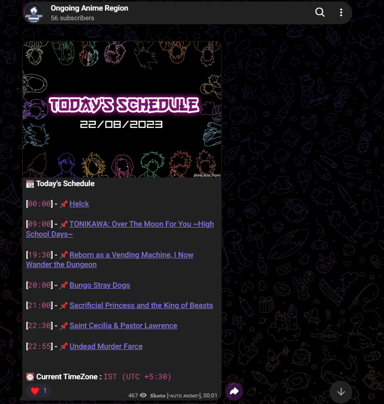
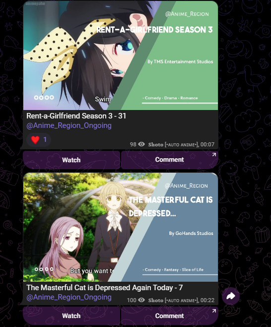

# 🤖 AutoAnime

### Automated Anime Download & Telegram Publishing Bot

**AutoAnime** is a Python-based automation bot that helps automate the process of finding ongoing anime episodes, downloading them, processing them, creating thumbnails, and publishing them to a Telegram channel.

It was built to reduce repetitive manual work and create an automated workflow for managing an ongoing-anime channel.

---

## 📸 Screenshots

### 📅 Daily Anime Schedule

AutoAnime can generate a daily schedule showing the anime expected to release that day.

<p align="center">
  
</p>

---

### 📺 Automatic Episode Posts

The bot can process an episode, create a thumbnail from the video, and prepare it for publishing on Telegram.

<p align="center">
  
</p>

---

## ✨ Features

- 🤖 Automated anime workflow
- 📥 Automatic episode downloading
- 📤 Automatic Telegram uploading
- 📅 Daily anime release schedule
- 🖼️ Automatic thumbnail generation
- 🎞️ Random video frame selection
- 🔎 Anime information fetching
- 📊 Episode information handling
- 🔄 Ongoing anime automation
- 📝 Automatic Telegram posts
- ⚡ Asynchronous processing
- 📱 Telegram integration

---

## 🧩 How It Works

The basic workflow looks like this:

```text
                AutoAnime
                    │
                    ▼
            Find New Episodes
                    │
                    ▼
             Get Anime Data
                    │
                    ▼
              Download File
                    │
                    ▼
             Process Video
                    │
                    ▼
          Select Random Frame
                    │
                    ▼
            Create Thumbnail
                    │
                    ▼
           Prepare Telegram Post
                    │
                    ▼
             Upload Episode
                    │
                    ▼
            Telegram Channel

```
---

## 💡 Why I Built It

I wanted to build something that could automate a repetitive real-world task instead of doing everything manually.

AutoAnime helped me understand how different systems can work together:

**Web Sources → Data → Download → Video Processing → Thumbnail → Telegram**

It gave me hands-on experience with automation, APIs, web scraping, video processing, image processing, scheduling, and Telegram bots.

---

## 👨‍💻 Developer

**Kaustuk**

[GitHub](https://github.com/kaustuklol)

Built from scratch with ❤️, Python, Pyrogram, OpenCV, Pillow and a lot of debugging.

⭐ If you like the project, consider giving the repository a star!

---

### 📌 Note

AutoAnime is an educational automation project. It does not host anime content itself and relies on external websites, APIs, and Telegram for its workflow.
